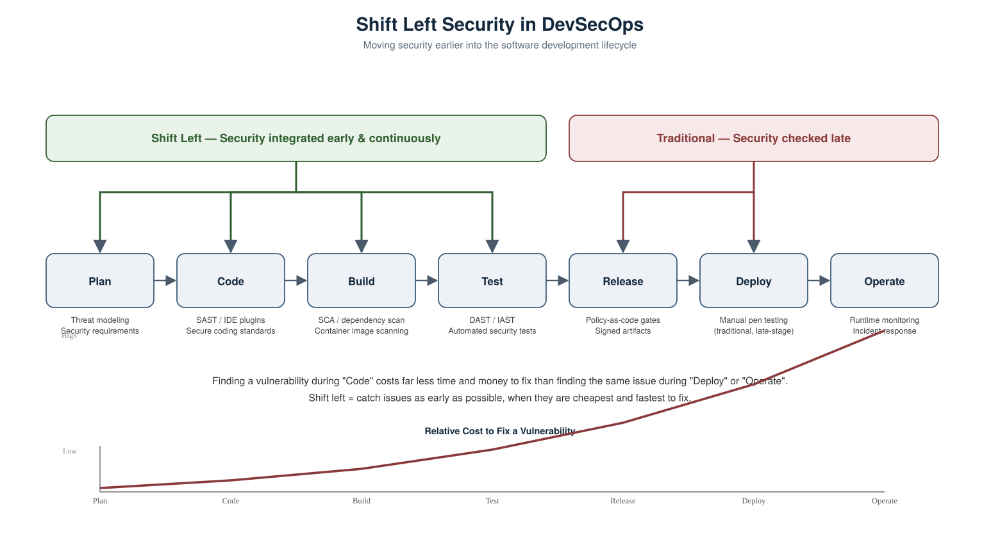

# Shift Left Security in DevSecOps

## What "Shift Left" Means

In a traditional software development lifecycle (SDLC), security is often treated as a final checkpoint — something that happens right before release, usually through manual penetration testing or a security team's sign-off. Visually, if you draw the SDLC as a left-to-right timeline (Plan → Code → Build → Test → Release → Deploy → Operate), security sits far to the **right**, at the end.

**Shift Left** means moving security activities earlier — to the **left** — in that timeline, so security is built into every stage of development instead of being bolted on at the end. Instead of asking "is this secure?" right before shipping, teams continuously ask that question from the moment a feature is planned.

## Why It Matters

The core argument for shifting left is simple: **the earlier a vulnerability is found, the cheaper and faster it is to fix.**

- A insecure design decision caught during **planning** costs a conversation.
- A vulnerable code pattern caught during **coding** (e.g. via an IDE plugin) costs a quick edit.
- The same issue found during **testing** costs a re-build and re-test cycle.
- Found during **deployment or production**, it can cost an incident response, emergency patch, customer trust, and potentially a security breach.

This is often visualized as an exponential cost curve — the cost to fix a vulnerability grows the further right it's discovered in the pipeline.

## How Shift Left Is Practiced

| SDLC Stage | Traditional Approach | Shift Left Practice |
|---|---|---|
| Plan | Security not considered | Threat modeling, security requirements defined upfront |
| Code | No automated checks | SAST (Static Application Security Testing) via IDE plugins, secure coding standards |
| Build | Manual review, if any | SCA (Software Composition Analysis) / dependency scanning, container image scanning |
| Test | Skipped or manual only | DAST/IAST integrated into CI, automated security test cases |
| Release | Security sign-off as a gate | Policy-as-code gates (e.g. OPA), signed and verified artifacts |
| Deploy | Manual penetration testing | Automated deployment validation, admission controllers enforcing policy |
| Operate | Reactive incident response | Continuous runtime monitoring and alerting |

## Common Tools Used to Shift Left

- **SAST** (Static Application Security Testing) — scans source code for vulnerabilities before it's even compiled (e.g. integrated into CI or IDEs).
- **SCA** (Software Composition Analysis) — scans dependencies/libraries for known vulnerabilities (e.g. Trivy, Snyk).
- **Container image scanning** — checks Docker images for vulnerable packages before they're pushed to a registry.
- **DAST** (Dynamic Application Security Testing) — tests a running application for vulnerabilities, run automatically in CI/CD rather than manually after release.
- **Policy-as-Code** — tools like OPA (Open Policy Agent) enforce security and compliance rules automatically as part of the pipeline, rather than through manual review.
- **Secrets management** — tools like HashiCorp Vault prevent hardcoded credentials from ever being committed to code.

## Key Takeaway

Shift Left isn't a single tool — it's a **mindset and process change**: security becomes everyone's responsibility (developers, not just a separate security team), enforced continuously and automatically throughout the pipeline, rather than being a manual gate at the very end.