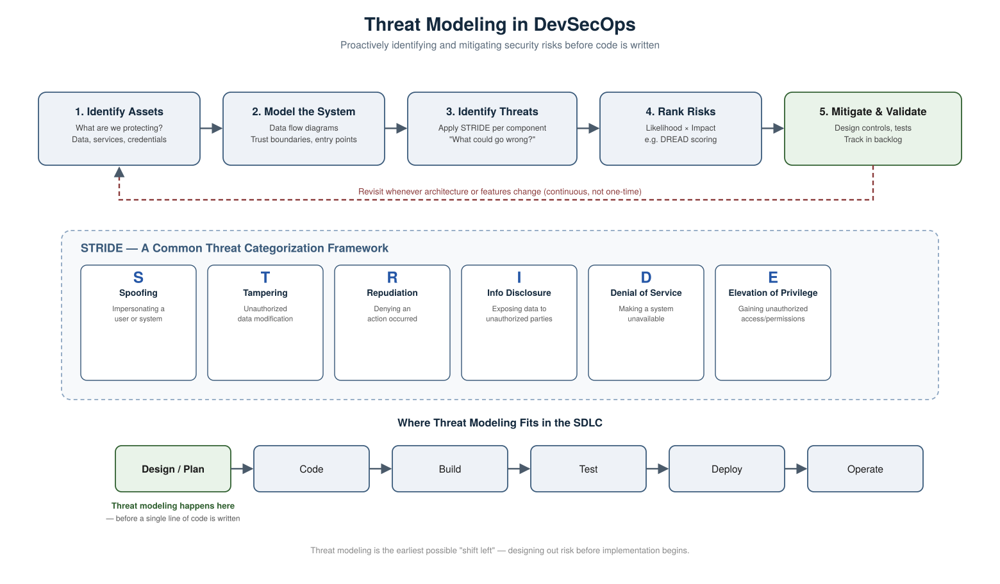

# Threat Modeling in DevSecOps

## What Is Threat Modeling

Threat modeling is a structured process for identifying, understanding, and mitigating potential security threats to a system — **before** it's built, not after. It answers a simple question early: *"What could go wrong here, and what are we going to do about it?"*

In DevSecOps, threat modeling is the earliest possible form of "shifting left" — it happens during design and planning, before a single line of code is written, so security is designed into the architecture rather than patched on afterward.

## The Threat Modeling Process

1. **Identify Assets** — Determine what needs protecting: sensitive data, credentials, APIs, business-critical services.
2. **Model the System** — Create a data flow diagram (DFD) showing how data moves through the system, where trust boundaries exist (e.g. between the internet and your internal network), and where external entry points are.
3. **Identify Threats** — For each component and data flow, systematically ask "what could go wrong?" A common framework for this is **STRIDE** (see below).
4. **Rank Risks** — Not every threat is equally serious. Prioritize based on likelihood and impact (frameworks like **DREAD** can help score this).
5. **Mitigate & Validate** — Design controls to address the highest-priority threats, track them as work items, and validate the mitigations actually work (e.g. through testing).

This isn't a one-time exercise — it should be revisited whenever the architecture changes, a new feature is added, or a new integration is introduced.

## STRIDE: A Common Threat Framework

STRIDE, developed by Microsoft, is a widely used mnemonic for categorizing threats:

| Letter | Threat | Example |
|---|---|---|
| **S** | Spoofing | An attacker impersonates a legitimate user or system |
| **T** | Tampering | Unauthorized modification of data, in transit or at rest |
| **R** | Repudiation | A user denies performing an action, with no way to prove otherwise |
| **I** | Information Disclosure | Sensitive data is exposed to someone who shouldn't see it |
| **D** | Denial of Service | A system is made unavailable to legitimate users |
| **E** | Elevation of Privilege | An attacker gains access or permissions they shouldn't have |

Teams typically walk through each component of their system's data flow diagram and ask which of these six threat types could apply.

## Where Threat Modeling Fits in DevSecOps

Threat modeling belongs at the **design/planning** stage of the SDLC — before code, build, test, or deployment. This is what makes it the purest example of "shift left" security: instead of finding a design flaw during a penetration test right before release (expensive and slow to fix), the flaw is designed out from the start.

That said, DevSecOps treats it as a **continuous, living practice**, not a one-off document — it should be revisited as the system evolves, integrated into design reviews, and ideally tracked alongside the codebase (e.g. as living documentation in the repo).

## Why It Matters

- **Cheaper to fix** — Design flaws found on a whiteboard cost a conversation. The same flaw found in production can cost an incident, a breach, and reputational damage.
- **Reduces blind spots** — Systematic frameworks like STRIDE catch classes of threats that ad-hoc reviews often miss.
- **Shared responsibility** — Threat modeling sessions typically include developers, architects, and security engineers together, spreading security ownership beyond a single "security team."
- **Feeds the rest of the pipeline** — Threats identified here directly inform what SAST rules, DAST test cases, and policy-as-code guardrails are worth building later in the pipeline.

## Common Tools

- **Microsoft Threat Modeling Tool** — free tool for creating DFDs and applying STRIDE
- **OWASP Threat Dragon** — open-source, lightweight threat modeling tool
- **IriusRisk** — automates threat modeling and ties it into the SDLC
- **PyTM** — "threat modeling as code," lets you define models in Python and version them alongside your codebase