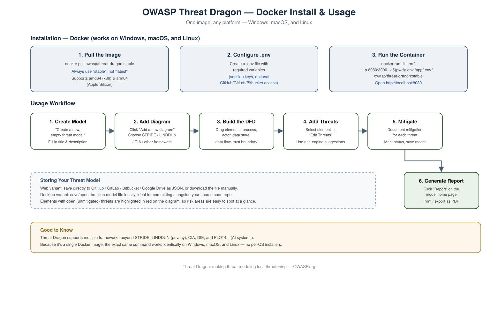

# How to Install and Use OWASP Threat Dragon (Docker)



## What Is OWASP Threat Dragon

OWASP Threat Dragon is a free, open-source threat modeling tool. It lets you draw data flow diagrams (DFDs), apply threat modeling frameworks (STRIDE, LINDDUN, CIA, DIE, PLOT4ai), record threats against each component, track their mitigations, and export the whole thing as a report. It's available as a desktop app or a web app — this guide covers running it as a **Docker container**, which is the easiest way to get a consistent setup across any team, regardless of OS.

## Why Docker

OWASP Threat Dragon also offers a desktop app and a from-source (npm) setup, but this guide focuses on **Docker only** — one image, one set of commands, and it works identically on Windows, macOS, and Linux. No per-OS installers, no Node.js version conflicts, nothing to compile.

## Installation (Docker)

### 1. Pull the Image
```bash
docker pull owasp/threat-dragon:stable
```
Always use the `stable` tag, not `latest` — `latest` can contain unreleased, potentially unstable changes. The `stable` image supports both `amd64` (x86) and `arm64` (Apple Silicon).

### 2. Configure Environment Variables
Threat Dragon needs a `.env` file to run — at minimum it requires session encryption keys, and optionally GitHub/GitLab/Bitbucket/Google Drive credentials if you want to save models directly to those services instead of downloading JSON manually.

Create a `.env` file in your working directory based on Threat Dragon's `example.env` template (see the [environment configuration guide](https://www.threatdragon.com/docs/) for the full variable list). At a minimum, without this file the container will fail to start with an error like:
```
Error: GITHUB_CLIENT_ID is a required property
```

### 3. Run the Container
```bash
docker run -it --rm -p 8080:3000 -v $(pwd)/.env:/app/.env owasp/threat-dragon:stable
```
- `-p 8080:3000` maps the container's internal port 3000 to your local port 8080 (change `8080` if that port is already in use)
- `-v $(pwd)/.env:/app/.env` mounts your `.env` file into the container
- **Windows users:** if `$(pwd)` doesn't resolve in your shell, substitute the absolute path to your `.env` file directly

Once running, open your browser to:
```
http://localhost:8080
```

To run it in the background instead of holding your terminal open, swap `-it --rm` for `-d`:
```bash
docker run -d -p 8080:3000 -v $(pwd)/.env:/app/.env owasp/threat-dragon:stable
```

## How to Use Threat Dragon

Once it's running (desktop or web), the workflow is the same:

### 1. Create a Threat Model
On the welcome screen, choose **"Create a new, empty threat model."** Fill in:
- **Title** (required)
- High-level system description, contributors, and other context (optional but recommended)

### 2. Add a Diagram
Inside your new model, click **"Add a new diagram."** Give it a name and choose a modeling framework — most commonly **STRIDE**, though LINDDUN (privacy-focused), CIA, DIE, and PLOT4ai (AI systems) are also supported.

### 3. Build the Data Flow Diagram (DFD)
In the diagram editor, drag elements from the stencil on the left onto the canvas:
- **Process** — a component that handles data (e.g. an API service)
- **Actor** — an external entity (e.g. a user or third-party system)
- **Data Store** — where data is persisted (e.g. a database)
- **Data Flow** — arrows showing how data moves between elements
- **Trust Boundary** — a boundary marking where trust level changes (e.g. internet → internal network)

Click any element to reposition it or edit its properties.

### 4. Add Threats to Each Element
Select an element and click **"Edit Threats."** Threat Dragon's built-in rule engine can auto-suggest likely threats based on the element type (e.g. a Process gets Spoofing/Tampering/Repudiation/Info Disclosure/DoS/Elevation of Privilege threats suggested under STRIDE). You can also add threats manually.

### 5. Document Mitigations
For each threat identified, describe the mitigation (the control or design change that addresses it) and mark its status. Elements with unmitigated ("open") threats are highlighted in **red** on the diagram, so risk areas are visually obvious at a glance.

### 6. Save and Generate a Report
- Save your model (in the web app, this can save directly to a connected GitHub/GitLab/Bitbucket repo or Google Drive as a JSON file; in the desktop app, it saves a local `.json` file).
- From the model's home page, click **"Report"** to generate a document summarizing the system, all identified threats, and their mitigation status. This can be printed or saved as a PDF.

## Why Save It as JSON / Alongside Your Code

Because threat models are stored as version-controllable JSON files, teams often commit them into the same repository as the application code (e.g. in a `ThreatDragonModels/` folder). This keeps the threat model discoverable, reviewable in pull requests, and easy to update as the architecture evolves — reinforcing that threat modeling is a living document, not a one-time report.

## Useful Links

- Project home: https://owasp.org/www-project-threat-dragon/
- Documentation: https://www.threatdragon.com/docs/
- GitHub repository & releases: https://github.com/owasp/threat-dragon